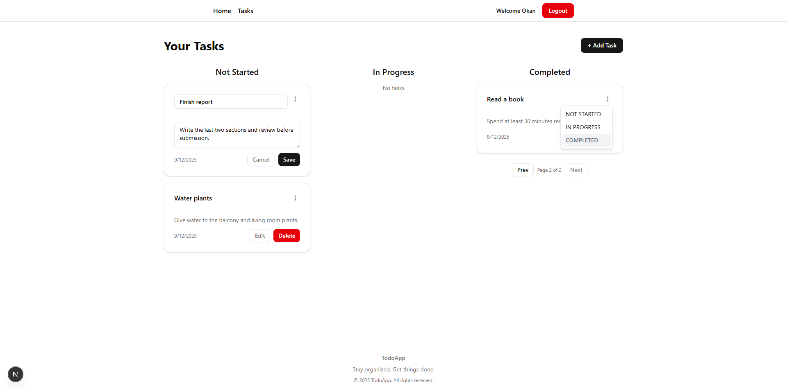
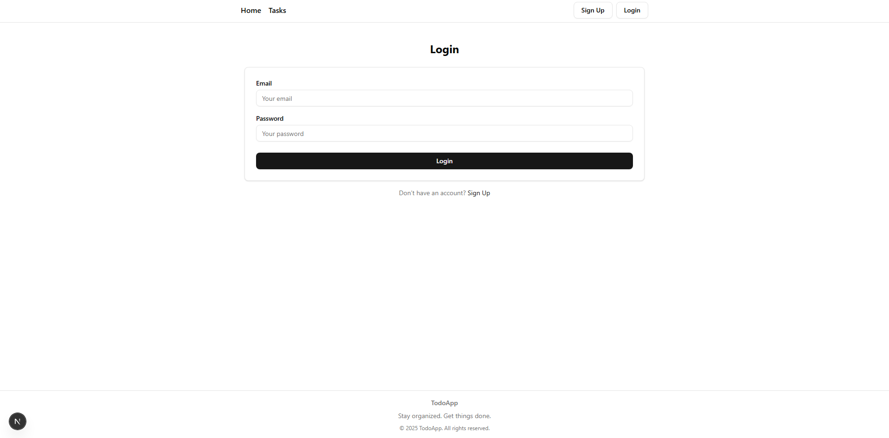

# 📝 Next-ToDo-App — Full-Stack Task Management Prototype

 

 

## 📌 Project Overview
Next-ToDo-App is a **full-stack task management** prototype built with **Next.js**.  
It demonstrates **modern web application patterns** with a focus on **simplicity**, **clean structure**, and **developer-friendly practices**.

The app enables users to securely sign in, create and update tasks, move them between statuses, and browse through a **clean, paginated UI**.  
⚡ **Optimistic updates** ensure a smooth experience, and the folder structure follows best practices for maintainability.

 

## ✨ Features

### 🧱 General Architecture
- 🌐 **Full-stack with Next.js** — frontend and backend in one codebase  
- 🧠 **Prisma ORM** — type-safe, reliable database operations  
- 🔐 **Authentication** — secure login and session handling with NextAuth  
- 🔄 **State Management** — React Query with optimistic updates for smooth UX  
- 🎨 **UI/UX** — Tailwind CSS + shadcn/ui for modern, minimal design  
- 📑 **Pagination** — clean and fast task lists with paginated display

---

### 📝 Task Management
- ➕ Create tasks with statuses: **Not_Started**, **In_Progress**, **Completed**  
- ✏️ Update or move tasks between statuses  
- 🗑️ Delete tasks instantly with optimistic feedback  
- 📄 Paginated listing for smooth browsing

 

## 🖼️ Screenshots

> ℹ️ A quick visual overview of the project’s main pages and features.

<table align="center">
  <tr>
    <td align="center">
       
      <b>Tasks Page</b>
    </td>
    <td align="center">
       
      <b>Login Page</b>
    </td>
    <td align="center">
       
      <b>Another Page</b>
    </td>
  </tr>
  <tr>
    <td align="center">
       
      <b>Tasks Page</b>
    </td>
    <td align="center">
       
      <b>Login Page</b>
    </td>
    <td align="center">
       
      <b>Another Pageaoeuaaoeuaoeauaoeuaoeaueoa</b>
    </td>
  </tr>
</table>

 

## 🧰 Tech Stack

This project was built using the following technologies:

  
  
  
  
  
  

 

## Installation
1. Clone the repository  
2. Install dependencies  
3. Configure `.env` variables (DATABASE_URL, NEXTAUTH_URL, NEXTAUTH_SECRET, etc.)  
4. Run `npx prisma migrate dev`  
5. Start the development server with `npm run dev`

 

## 📜 License

This project is licensed under the terms described in the [LICENSE](./LICENSE) file.

---

© 2025 Yusuf Okan Sirkeci — [Hereetria](https://github.com/Hereetria)
